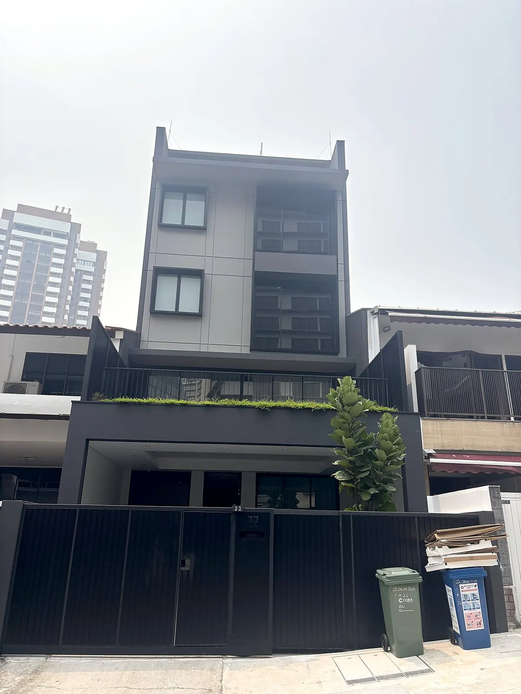
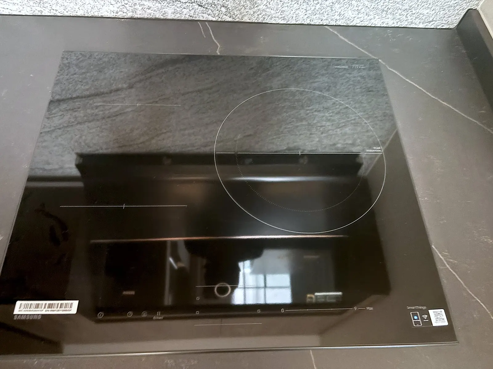
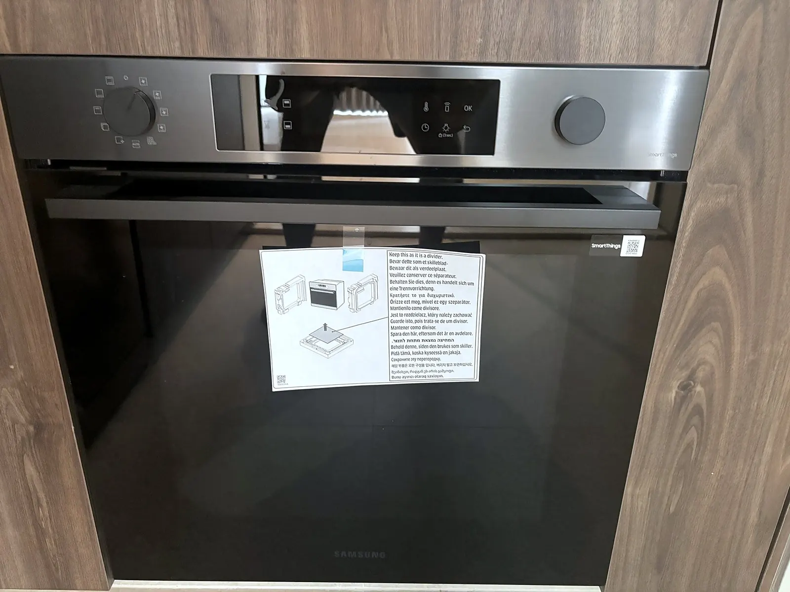
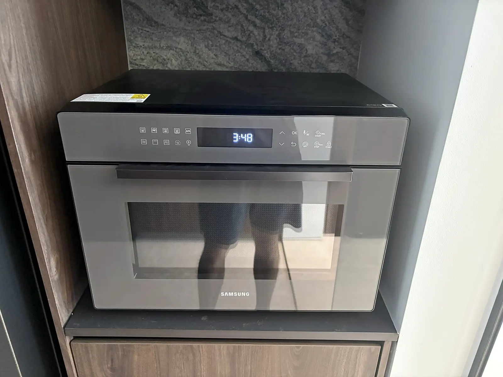
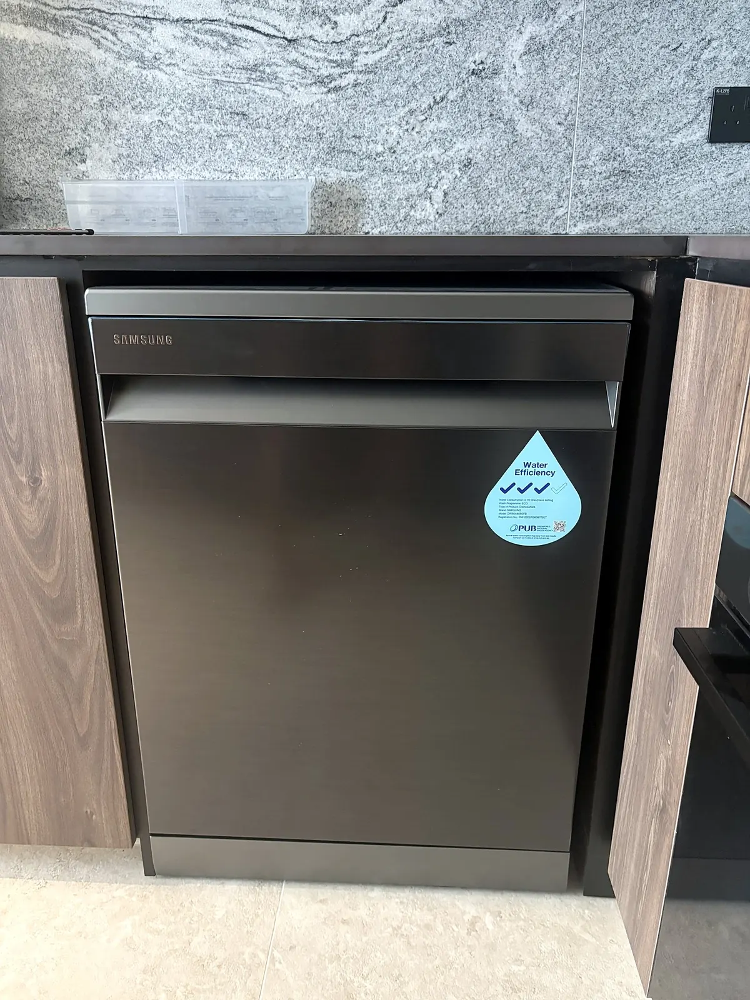
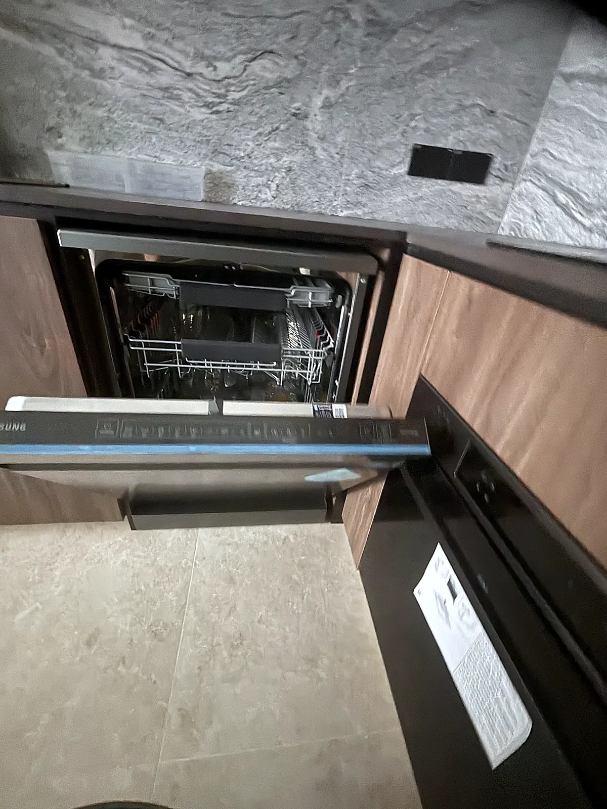
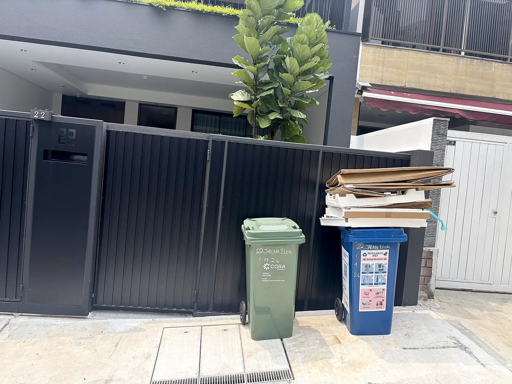
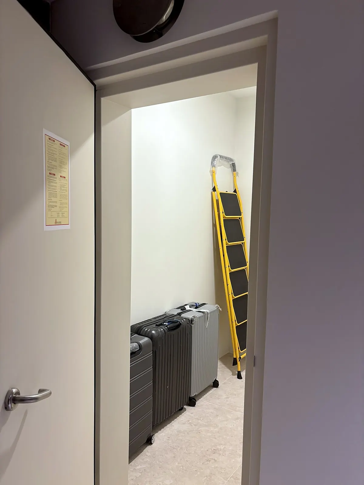
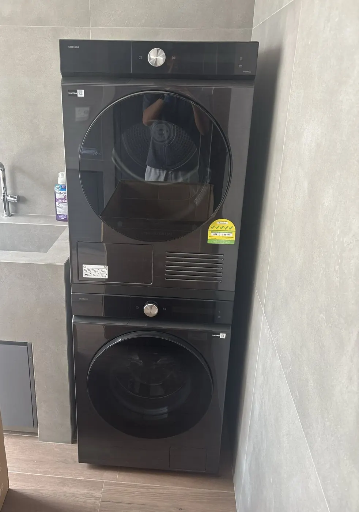

<!--
  HOW TO EDIT THIS GUIDE
  ----------------------
  This file IS the house guide. Edit the text, save/commit, and 22je.sg/guide/
  updates within a minute or two. On github.com: open this file, click the
  pencil icon, edit, then "Commit changes".

  - "## Heading" starts a new section (it also appears in the contents list).
  - "### Heading" is a sub-heading inside a section.
  - "1." makes a numbered step, "-" makes a bullet.
  - Anything written as [to confirm] is highlighted in yellow on the page,
    so you can see at a glance what still needs filling in.
  - Photos: put the file in assets/img/guide/ and write
    
  - This page is PUBLIC. Never put door codes, Wi-Fi passwords or
    alarm codes here; give those to residents in person or by WhatsApp.
-->

_Last updated: 8 October 2026_

Welcome home. This guide covers the everyday things about living at 22 Jalan Elok. If anything here is unclear or out of date, message us. We'd rather you ask than guess.

## Key contacts

| Who | How |
|---|---|
| **Kevin (house manager)** | [WhatsApp Kevin](https://wa.me/6580167691?text=Hi%20Kevin%2C%20I%27m%20staying%20at%2022%20Jalan%20Elok.%20) · call [+65 8016 7691](tel:+6580167691) · [info@22je.sg](mailto:info@22je.sg) |
| **Ambulance / fire** | [**995**](tel:995) |
| **Police (emergency)** | [**999**](tel:999) |
| **Police (non-emergency)** | [1800 255 0000](tel:18002550000) |
| **Lift faults (ELETEC Elevators hotline)** | [**+65 8128 9615**](tel:+6581289615) |

On your phone, tap a link to open a WhatsApp chat with Kevin or to call the number straight away.

Kevin is your first point of contact for anything about the house. In an emergency, call the emergency number first, then message Kevin.

**Address:** 22 Jalan Elok, Singapore 229060

## Getting in and out

- **Main door:** it has a code lock. We'll send you the code together with the Wi-Fi details, closer to your move-in date.
- **Your room:** you get **two keys** to your room.
- **Gate:** a gate remote is provided to **one person**.
- Always close the front gate and lock the main door behind you, even when popping out.
- Never share the main door code with anyone else.
- If you lose a key or the remote, tell us straight away so we can secure the house. Replacements cost **S$10 per key** and **S$50 per remote**.

## Wi-Fi

We'll send you the network name and password, together with the main door code, closer to your move-in date. The house runs on Wi-Fi access points rather than a router you can reach, so if the Wi-Fi drops or is slow, just let us know and we'll sort it out.

## Your room

- **Air-con:** keep the windows and door closed while it's on, and switch it off when you go out.
- **Blackout curtains:** close them fully for a dark room at any hour.
- **Ensuite bathroom:** the exhaust fan runs whenever the bathroom light is on. After showering, leave the light on for a few minutes (or the door open) to clear the steam and keep mould away. Only toilet paper goes down the toilet.
- **Night light:** if you'd like one, just ask and we'll provide it.
- **Housekeeping** comes **every Saturday** to clean your room. **It doesn't include laundry:** laundry is self-service, on the [laundry terrace](#laundry-terrace-5th-floor).
  - **Weekly housekeeping is part of every stay and isn't optional.** It keeps every room clean and in good condition. We'll always knock before entering, but if there's no answer, we will still come in.

## Shared spaces

You're welcome to use the **living room, dining area and kitchen**, the **open balcony off the living room** (2nd floor) and the **front terrace**.

- Wash, dry and put away anything you use in the kitchen.
- There are **two shared fridges** and no fridges in the rooms. Clear out anything expired.
- **Label everything you keep in the fridges and shared spaces clearly with your room.** Anything that isn't clearly labelled will be thrown out when housekeeping comes on Saturday.
- Wipe down the hob and counter after cooking.
- Close the balcony doors when it rains and when you're the last to leave.

## Kitchen appliances

All the kitchen appliances are Samsung. Please wipe them down after use and leave them as you found them.

### Induction hob

1. **Use induction-compatible pans only.** The base must be flat and magnetic: if a fridge magnet sticks to it, it works.
2. Touch **⏻** to switch the hob on, put the pan on one of the **three cooking zones**, then slide your finger along the **0–9 bar** to set the heat (**Max** is the strongest). The large zone has a double ring that adjusts to the size of your pan.
3. Switch on the **cooker hood** above the hob while you cook.
4. **Need to stop everything quickly?** Touch **‖** to pause all zones at once.
5. Touch **⏻** again when you've finished. The glass stays hot for a while after cooking, so don't touch it.
6. **If the controls don't respond,** the child lock may be on: touch and hold the lock key for 3 seconds.

Lift pans rather than sliding them, so the glass doesn't scratch. Wipe up spills once the hob has cooled.

### Oven

1. Turn the **left dial** to the cooking mode you want, such as fan or grill.
2. Turn the **right dial** to set the temperature, then touch **OK**.
3. Let the oven heat up before putting food in, and always use oven gloves.
4. When you've finished, turn the **left dial** back to the **off** position.

Please don't line the bottom of the oven with foil, and keep the oven door closed when you're not using it: the dishwasher next to it can't open while the oven door is open.

### Combination microwave

This is a microwave that can also grill and bake.

- **Quick heat-up:** put the food in a microwave-safe dish, close the door and press **Start / +30s**. Each press adds 30 seconds at full power.
- **Other modes:** touch the mode you want, set the time with **▲ ▼**, touch **OK**, then press **Start**.
- **Stop / Eco:** press once to pause, twice to cancel.
- **Never put metal, foil or sealed containers in** when microwaving. In grill or bake mode, the dish and the inside get very hot.
- **If the buttons don't respond,** the child lock may be on: touch and hold the padlock for 3 seconds.

### Dishwasher

> **⚠️ Close the oven door before you open the dishwasher.**
>
> The dishwasher and the oven meet at the corner, so the dishwasher door can't open while the oven door is open.

1. Scrape leftover food into the bin first.
2. Load plates in the bottom rack facing the middle, and cups and glasses upside down in the top rack. Make sure nothing blocks the spinning spray arms.
3. Put **one dishwasher tablet** in the dispenser on the inside of the door and close its lid. **Tablets are provided**: you'll find them under the sink.
4. Close the door, choose a programme on the controls along the top edge of the door, and start it.
5. When it's finished, put the clean dishes away. If you find the dishwasher full of clean dishes, please empty it before loading yours.

Keep wooden boards and utensils, non-stick pans and anything not marked "dishwasher safe" out of the dishwasher; wash those by hand.

## The lift

- Keep the lift doors clear, and never force them open.
- Don't exceed the load shown inside the lift. For heavy luggage, take one trip at a time.
- If the lift stops between floors, press the alarm button inside and call **ELETEC Elevators on +65 8128 9615**, then message Kevin. Don't try to climb out.
- If the lift isn't working, call ELETEC on the same number and let Kevin know.

## Rubbish

Singapore takes rubbish seriously, and loose rubbish attracts ants and pests quickly in the heat. **There's no shared rubbish bin inside the house**, so please take your own rubbish out.

1. Bag all rubbish and **tie the bag tightly**.
2. Wrap wet food waste in its own small bag first, so the bag doesn't leak.
3. Take it to the **green bin by the front gate**. Don't leave rubbish bags anywhere in the house, including the kitchen.
4. Close the bin lid fully. Never leave bags beside the bin, even for a night.

Rubbish is collected **every day**.

**Recycling:** clean, dry paper, plastic, glass and metal can go in the **blue bin**. If you're not sure whether something can be recycled, put it in the green bin with the rest of the rubbish.

## Luggage storage

There's a luggage storeroom **by the entrance on the 1st floor**, so you can keep empty suitcases out of your room. Please label your suitcases with your room.

## Laundry terrace (5th floor)

The laundry terrace is an open terrace on the 5th floor, across the lift landing from the Aurelia Suite. **Laundry is self-service:** housekeeping doesn't wash clothes, so please do your own here. It's **free to use, at any time**. Please keep the noise down late at night and early in the morning.

**Not sure how the machines work?** Just ask us. We're happy to show you.

Both machines are **Samsung Bespoke AI** models with a single dial. The **washer** (a 9 kg front-loader, model WW90DB8U94GBSP) is the **bottom machine**, and the **dryer** (a 10 kg heat-pump dryer, model DV10BB9440GBSP) is **on top**. Each has three controls:

| Control | What it does |
|---|---|
| **⏻ Power** | Turns the machine on and off |
| **Dial** | Turn to choose a cycle (the name shows on the display); press to see options |
| **▷‖ Start / Pause** | Starts the cycle, or pauses it |

### Using the washer (bottom machine)

1. **Prepare:** empty pockets (tissues and coins cause the most trouble), close zips, and put delicates and bras in a mesh bag. Wash darks and whites separately.
2. **Load:** fill the drum loosely, no more than about **three-quarters full**. Close the door until it clicks.
3. **Add detergent:** pull out the drawer at the top left of the washer and pour one capful of liquid detergent into the detergent compartment. Don't use the large Auto Dispense tanks, as we don't fill them. **Detergent is provided**: use the bottle on the shelf across from the machines. One capful is plenty, because front-loaders need very little.
4. Press **⏻ Power**.
5. **Turn the dial** to choose a cycle:
   - **AI Wash** or **Cotton**: everyday clothes, towels and bedding
   - **Synthetics**: sportswear, polyester
   - **Delicates** or **Wool**: anything you'd normally hand-wash
   - **Quick Wash 15'**: a small, lightly worn load
   - **Super Speed**: a normal load in a hurry (about 39 minutes)
   - **Bedding** and **Towels**: as named
6. Press **▷‖ Start**. The door locks while the machine runs.
7. When it finishes, take your clothes out promptly and **leave the door slightly open** so the drum can air.

**Forgot something?** Press **▷‖** to pause. Once the door unlocks you can add it, close the door and press **▷‖** again.

### Using the dryer (top machine)

> **⚠️ Clean the lint filter before every load, or your clothes will come out damp.**
>
> A full filter blocks the airflow, so the dryer runs longer and still finishes with wet clothes. It only takes ten seconds: see step 2 below. Please clean it even if the person before you didn't.

1. **Check the care labels.** Don't tumble-dry wool, silk, lace, or anything marked "do not tumble dry". Never put shoes, rubber-backed mats or anything with rubber or foam inside.
2. **Clean the lint filter, before every load.** It sits inside the door opening. Lift it out, open it, wipe the lint off with your fingers, then close it and slide it back in. Skip it and your clothes come out damp.
3. Load the clothes loosely and close the door.
4. Press **⏻ Power**, **turn the dial** to choose a cycle (**AI Dry** or **Cotton** suits most loads, and **Synthetics** suits sportswear), then press **▷‖ Start**. There's no water tank to empty: the dryer drains straight into the plumbing.
5. Take your clothes out as soon as the cycle ends. They'll wrinkle less.

### Please don't

- Overload either machine, or wash or dry rubber-backed mats or shoes.
- Leave your laundry sitting in the machines after the cycle ends. Others may be waiting.
- Put anything on top of the dryer, or lean on the stacked machines.
- Open the cover at the bottom front of the dryer. We clean that filter during housekeeping.

### If something goes wrong

- **The door won't open:** wait a minute or two after the cycle ends, because the door unlocks by itself. If it still won't open, message us. Don't force it.
- **The display shows an error code:** take a photo of the display and WhatsApp it to us.
- **Water on the floor:** switch the machine off at **⏻**, then message us.

## Quiet hours and house rules

- **Quiet hours:** 10 pm – 8 am. Keep voices, music and calls low in the shared spaces during these hours.
- **No smoking or vaping anywhere in the house**, including the balcony and the front terrace.
- **No additional guests.** Only the people named on your tenancy agreement may stay in the house.
- **No pets.**
- Please don't move furniture between rooms or put anything up on the walls without asking us first.

## Moving out

1. Let us know your move-out date and time in advance.
2. Leave the room tidy, clear your food out of the fridges, and take your rubbish out to the bin by the front gate.
3. **Take photos of the room before you leave**, to be safe. Get the whole room, the bathroom, and anything you'd want on record. Keep them until your deposit is back.
4. Return both room keys, and the gate remote if you hold it. Any that are missing are charged at S$10 per key and S$50 per remote.
5. We inspect the room after you move out and refund your deposit within 7 days.
