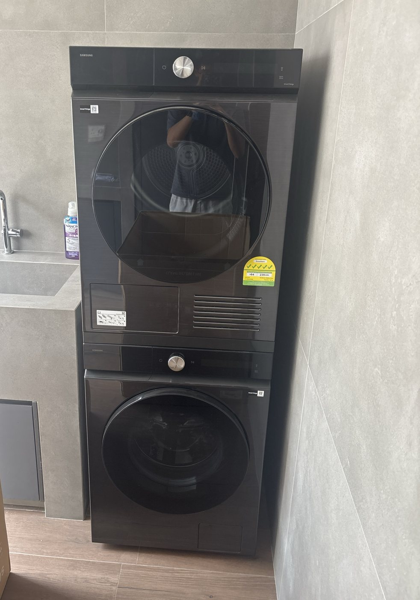

<!--
  HOW TO EDIT THIS GUIDE
  ----------------------
  This file IS the house guide. Edit the text, save/commit, and 22je.sg/guide/
  updates within a minute or two. On github.com: open this file, click the
  pencil icon, edit, then "Commit changes".

  - "## Heading" starts a new section (it also appears in the contents list).
  - "### Heading" is a sub-heading inside a section.
  - "1." makes a numbered step, "-" makes a bullet.
  - Anything written as [to confirm] is highlighted in yellow on the page,
    so you can see at a glance what still needs filling in.
  - Photos: put the file in assets/img/guide/ and write
    
  - This page is PUBLIC. Never put door codes, Wi-Fi passwords or
    alarm codes here; give those to residents in person or by WhatsApp.
-->

_Last updated: 8 October 2026_

Welcome home. This guide covers the everyday things about living at 22 Jalan Elok. If anything here is unclear or out of date, message us. We'd rather you ask than guess.

## Key contacts

| Who | How |
|---|---|
| **Kevin (house manager)** | WhatsApp **+65 8016 7691** [to confirm: is this Kevin's number?] · info@22je.sg |
| **Ambulance / fire** | **995** |
| **Police (emergency)** | **999** |
| **Police (non-emergency)** | 1800 255 0000 |

Kevin is your first point of contact for anything about the house. In an emergency, call the emergency number first, then message Kevin.

**Address:** 22 Jalan Elok, Singapore 229060

## Getting in and out

- **Main door:** it has a code lock. We'll send you the code together with the Wi-Fi details, closer to your move-in date.
- **Your room:** you get **two keys** to your room.
- **Gate:** a gate remote is provided to **one person**.
- Always close the front gate and lock the main door behind you, even when popping out.
- Never share the main door code with anyone else.
- If you lose a key or the remote, tell us straight away so we can secure the house. Replacements cost **S$10 per key** and **S$50 per remote**.

## Wi-Fi

We'll send you the network name and password, together with the main door code, closer to your move-in date. If the Wi-Fi drops, message us. Please don't unplug or reset the router yourself.

## Your room

- **Air-con:** keep the windows and door closed while it's on, and switch it off when you go out.
- **Blackout curtains:** close them fully for a dark room at any hour.
- **Ensuite bathroom:** run the exhaust fan or leave the door open after showering to keep mould away. Only toilet paper goes down the toilet.
- **Housekeeping** comes **every Friday** and includes laundry. [to confirm: how residents hand over laundry]

## Shared spaces

You're welcome to use the **living room, dining area and kitchen**, the **open balcony off the living room** (2nd floor) and the **front terrace**.

- Wash, dry and put away anything you use in the kitchen.
- Label your food in the fridge, and clear out anything expired. [to confirm: fridge shelf per room?]
- Wipe down the hob and counter after cooking.
- Close the balcony doors when it rains and when you're the last to leave.

## The lift

- Keep the lift doors clear, and never force them open.
- Don't exceed the load shown inside the lift. For heavy luggage, take one trip at a time.
- If the lift stops between floors, press the alarm button inside and WhatsApp us. Don't try to climb out.

## Rubbish and recycling

Singapore takes rubbish seriously, and loose rubbish attracts ants and pests quickly in the heat.

### General rubbish

1. Bag all rubbish and **tie the bag tightly**. No loose rubbish in the bins.
2. Wrap wet food waste in its own small bag first, so the bag doesn't leak.
3. Take full bags to the main bin at [to confirm: where the outdoor bin is, e.g. by the front gate].
4. Close the bin lid fully. Never leave bags beside the bin, even for a night.

Rubbish is collected **every day**. Kitchen bin bags are kept [to confirm: where spare bin bags are].

### Recycling (the blue bin)

The blue recycling bin is at [to confirm: location]. It takes **paper, plastic, glass and metal**.

- Empty and rinse bottles, cans and containers. They must be **clean and dry**.
- Flatten cardboard boxes.
- **Not recyclable:** food, liquids, tissues and paper towels, food-stained containers or pizza boxes, nappies.
- If you're unsure, put it in general rubbish. One dirty item can spoil the whole bin.

### Anything else

- **Batteries, light bulbs, electronics, bulky items (furniture, boxes from moving in):** don't put them in either bin. Message us and we'll arrange it.

## Laundry room (5th floor)

The laundry room is on the 5th floor, across the lift landing from the Aurelia Suite. You can use it at any time, but please keep the noise down late at night and early in the morning.

Both machines are **Samsung Bespoke AI** models with a single dial. The **washer is the bottom machine** and the **dryer is on top**. Each has three controls:

| Control | What it does |
|---|---|
| **⏻ Power** | Turns the machine on and off |
| **Dial** | Turn to choose a cycle (the name shows on the display); press to see options |
| **▷‖ Start / Pause** | Starts the cycle, or pauses it |

### Using the washer (bottom machine)

1. **Prepare:** empty pockets (tissues and coins cause the most trouble), close zips, and put delicates and bras in a mesh bag. Wash darks and whites separately.
2. **Load:** fill the drum loosely, no more than about **three-quarters full**. Close the door until it clicks.
3. **Add detergent:** pull out the drawer at the top left of the washer and pour in liquid detergent. **Detergent is provided**: use the bottle on the shelf beside the machines. One capful is plenty, because front-loaders need very little.
4. Press **⏻ Power**.
5. **Turn the dial** to choose a cycle:
   - **AI Wash** or **Cotton**: everyday clothes, towels and bedding
   - **Synthetics**: sportswear, polyester
   - **Delicates** or **Wool**: anything you'd normally hand-wash
   - **Quick Wash**: a small, lightly worn load
6. Press **▷‖ Start**. The door locks while the machine runs.
7. When it finishes, take your clothes out promptly and **leave the door slightly open** so the drum can air.

**Forgot something?** Press **▷‖** to pause. Once the door unlocks you can add it, close the door and press **▷‖** again.

### Using the dryer (top machine)

1. **Check the care labels.** Don't tumble-dry wool, silk, lace, or anything marked "do not tumble dry". Never put shoes, rubber-backed mats or anything with rubber or foam inside.
2. **Clean the lint filter, every single load.** It sits inside the door opening. Lift it out, open it, wipe the lint off with your fingers, then close it and slide it back in. A clogged filter makes drying slow and uses more power.
3. Load the clothes loosely and close the door.
4. Press **⏻ Power**, **turn the dial** to choose a cycle (**AI Dry** or **Cotton** suits most loads, and **Synthetics** suits sportswear), then press **▷‖ Start**.
5. **Empty the water tank if its light comes on.** This is a heat-pump dryer, so it collects water from your clothes. Pull out the drawer at the top left of the dryer, empty it into the sink, and push it back in. [to confirm: if the dryer drains straight into the plumbing, delete this step]
6. Take your clothes out as soon as the cycle ends. They'll wrinkle less.

### Please don't

- Overload either machine, or wash or dry rubber-backed mats or shoes.
- Leave your laundry sitting in the machines after the cycle ends. Others may be waiting.
- Put anything on top of the dryer, or lean on the stacked machines.
- Open the cover at the bottom front of the dryer. We clean that filter during housekeeping.

### If something goes wrong

- **The door won't open:** wait a minute or two after the cycle ends, because the door unlocks by itself. If it still won't open, message us. Don't force it.
- **The display shows an error code:** take a photo of the display and WhatsApp it to us.
- **Water on the floor:** switch the machine off at **⏻**, then message us.

## Quiet hours and house rules

- **Quiet hours:** [to confirm: e.g. 10 pm – 8 am]. Keep voices, music and calls low in the shared spaces during these hours.
- **No smoking or vaping anywhere in the house**, including the balcony and the front terrace.
- **No additional guests.** Only the people named on your tenancy agreement may stay in the house.
- **No pets.**
- Please don't move furniture between rooms or put anything up on the walls without asking us first.

## Moving out

1. Let us know your move-out date and time in advance.
2. Leave the room tidy, with the fridge shelf cleared and your rubbish bagged and thrown out.
3. Return both room keys, and the gate remote if you hold it. Any that are missing are charged at S$10 per key and S$50 per remote.
4. We inspect the room with you and refund your deposit within 7 days.
